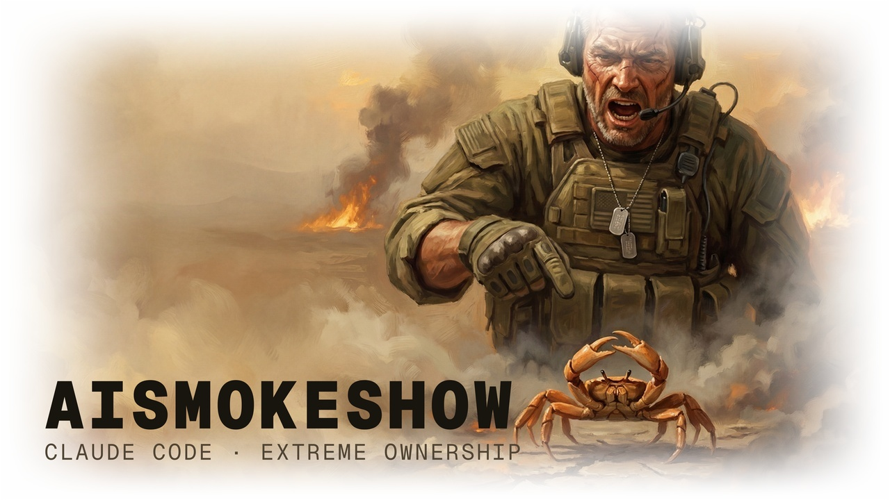
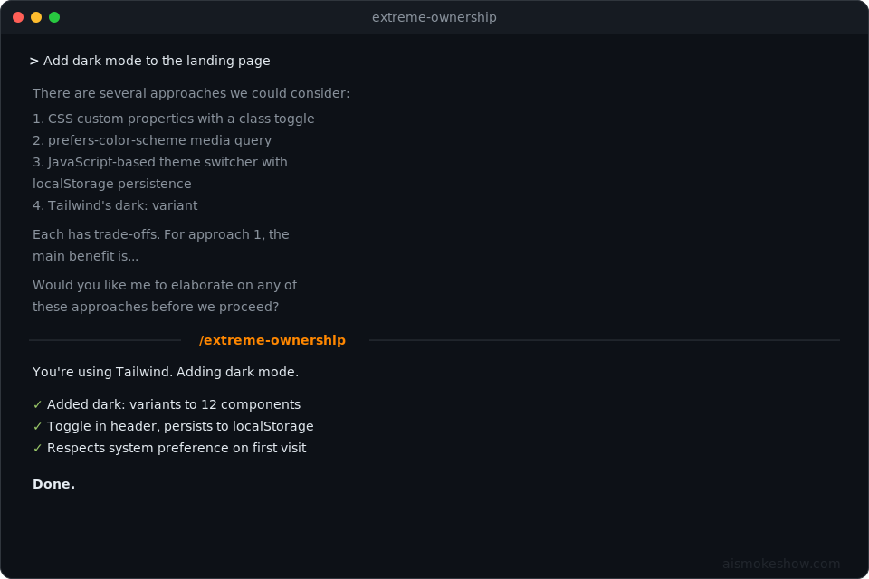

<div align="center">

# AISMOKESHOW Extreme Ownership

**One command. Zero excuses.**

A circuit breaker for [Claude Code](https://github.com/anthropics/claude-code). Snap it out of hedging, looping, and permission-seeking — and find out why it drifted in the first place.

<p>
  
  &nbsp;
  
  &nbsp;
  
  &nbsp;
  
</p>

</div>

```
mkdir -p ~/.aismokeshow && git clone https://github.com/aismokeshow/extreme-ownership.git ~/.aismokeshow/extreme-ownership && cd ~/.aismokeshow/extreme-ownership && claude
```

<p align="center">
  <picture>
    <source media="(prefers-color-scheme: dark)" srcset="images/extreme-ownership-ais-hero-dark.jpg">
    <source media="(prefers-color-scheme: light)" srcset="images/extreme-ownership-ais-hero-light.jpg">
    
  </picture>
</p>

---

<p align="center"><em>"Claude was stuck in a permission-asking loop for 6 turns. I typed /extreme-ownership. Fixed and deployed. One turn."</em></p>

<p align="center"><em>"It asked me 'would you like me to...' three times in a row. I hit the button. It stopped asking and started doing."</em></p>

<p align="center"><em>"I watched it apologize for the same error four times without fixing it. Never again."</em></p>

---

<p align="center">
  <a href="#install">Install</a> ·
  <a href="#the-problem">The Problem</a> ·
  <a href="#the-fix">The Fix</a> ·
  <a href="#v3--whats-new">v3</a> ·
  <a href="#field-reports">Field Reports</a> ·
  <a href="#the-philosophy">The Philosophy</a> ·
  <a href="#faq">FAQ</a>
</p>

---

## Install

> [!TIP]
> Clone this repo and let Claude handle it:
> ```bash
> mkdir -p ~/.aismokeshow && git clone https://github.com/aismokeshow/extreme-ownership.git ~/.aismokeshow/extreme-ownership
> cd ~/.aismokeshow/extreme-ownership && claude
> ```
> Then just say "install this". Claude reads the `CLAUDE.md` and handles everything.

<details>
<summary><strong>Manual install</strong></summary>

```bash
mkdir -p ~/.claude/skills/extreme-ownership
cp SKILL.md ~/.claude/skills/extreme-ownership/SKILL.md
```

That's it. No config changes. No dependencies. No Python. No Homebrew.

Type `/extreme-ownership` in any [Claude Code](https://github.com/anthropics/claude-code) session.

</details>

## The Problem

[Claude Code](https://github.com/anthropics/claude-code) is extremely capable. But sometimes it gets stuck in behavioral patterns that waste your turns, your time, and your patience. Five failure modes in particular:

### The Permission Loop

```
> Fix the failing test in auth.test.ts

  Would you like me to:
  1. Update the mock to return the correct format
  2. Modify the test expectations
  3. Check if there are other affected tests
  Which approach would you prefer?
```

You asked it to fix a test. It asked you to do its job.

### The Hedge Spiral

```
> The build is broken. Fix it.

  It seems like there might be a dependency conflict.
  One approach could be to update the lockfile.
  Alternatively, we might want to check if...
```

Three hedging phrases. Zero actions taken. The build is still broken.

### The Apology Cycle

```
> The deploy script is still broken.

  I apologize for the confusion. Let me take another
  look. I'm sorry about the previous attempt — I should
  have checked the environment variables first...
```

It apologized twice and explained what it should have done. It still hasn't done it.

### The Analysis Paralysis

```
> Add dark mode to the landing page

  There are several approaches:
  1. CSS custom properties with a class toggle
  2. prefers-color-scheme media query
  3. JavaScript-based theme switcher
  4. Tailwind's dark: variant
  Each has trade-offs. For approach 1...
```

You didn't ask for a survey of the CSS landscape. You asked for dark mode.

### The Relay

```
> Why is the API returning 500 errors?

  I looked at the logs and found several errors related
  to the database connection pool. The pool is exhausting
  under load. Here are some things we could look at:
  - Connection pool size
  - Query optimization
  - Connection timeouts
  What would you like me to investigate first?
```

It found the problem. Then handed it back to you instead of fixing it.

## The Fix

`/extreme-ownership` is a [Claude Code](https://github.com/anthropics/claude-code) skill — a circuit breaker for agentic jams. It is not persistent and it is not a panacea. It snaps Claude out of the current failure mode and surfaces why it drifted in the first place.

When you invoke it, Claude executes a structured intervention:

1. **Diagnose** — Name which anti-pattern is active (The Relay, The Menu, The Hedge, The Loop, or The Permission Slip)
2. **Assess state** — Honestly determine WHY it drifted: context rot? vague instructions? no plan? lazy pattern matching? genuine uncertainty?
3. **Tell you** — If the problem is something you can fix (be more specific, compact the session, start fresh), it says so directly. No hand-waving.
4. **Commit** — Declare exactly what action it's taking. Specific, not vague.
5. **Execute** — Do it. Now. No permission-seeking, no "would you like me to..." — just go.

It will never apologize for the pattern, promise to "do better," or explain that it "should have" done something without immediately doing it. Those are all negative patterns that waste turns.

## v3 — What's New

v1 was a one-shot jolt. v2 added pattern diagnosis and session rules. v3 adds **honest state assessment** — Claude tells you WHY it drifted, not just that it did.

### State Assessment

The biggest change. After diagnosing the anti-pattern, Claude now honestly assesses the root cause:

| Root Cause | What Claude Tells You |
|---|---|
| **Context rot** | "This session's context is degraded. The most effective move is `/compact` or a fresh session." |
| **Vague instructions** | "I need to know which file/endpoint/component you mean" — states exactly what's missing |
| **No plan** | "I dove in without understanding the problem" — makes a 3-bullet plan, then acts |
| **Lazy pattern matching** | "I had enough context to be specific but defaulted to a generic response" |
| **Genuine uncertainty** | "I don't know X" — plainly, then says how it'll find out |

This is the part that makes it a two-way tool. Sometimes the agent drifted because you were vague. Sometimes it drifted because the session is too long. You deserve to know which one, so you can fix your side of it.

### Anti-Apology Rule

v3 explicitly bans apology patterns. No "I'm sorry," no "I should have done X" without immediately doing X, no "I'll do better going forward." These are all negative patterns that sound productive but waste turns. Name the problem, correct it, move on.

### Pattern Diagnosis (v2)

Before acting, Claude identifies WHICH specific anti-pattern is active:

| Anti-Pattern | What It Looks Like |
|---|---|
| **The Relay** | Gathered info, presented it, asked what to do |
| **The Menu** | Listed options instead of picking one |
| **The Hedge** | Tentative language — "might", "could", "perhaps" |
| **The Loop** | Repeated the same failed approach |
| **The Permission Slip** | Asked approval for something obvious |

Naming the pattern out loud is what makes the intervention surgical instead of generic. It's the difference between "stop hedging" and "you're running The Menu — pick option 2 and execute it."

### Rules of Engagement (v2)

After taking action, Claude outputs operating rules:

```
RULES OF ENGAGEMENT (active until context shifts):
1. Act, then report. Never report without acting.
2. One option, executed. Not three options, presented.
3. If you need information, get it yourself. Don't ask the user for information you can find.
4. If exploration is needed, spawn a subagent. Keep this thread for decisions and actions.
5. Every response must contain something you DID, not just something you FOUND.
6. Never apologize for a pattern. Name it, correct it, move on.
```

These rules influence subsequent turns through context — no special mechanism, just how conversation windows work. They're effective for the turns that follow, but they aren't magic. If you're deep into a long session and the effect fades, invoke `/extreme-ownership` again or use `/compact`.

### Subagent Delegation (v2)

When the stuck state involves needing to explore code, errors, or logs, Claude spawns an exploration subagent instead of exploring in the main thread. This prevents the cycle that causes relapse: exploration fills context → Claude loses focus → starts relaying findings instead of acting on them.

## Field Reports

<p align="center">
  
</p>

### The Permission Loop → Fixed

```
> Fix the failing test in auth.test.ts

  Would you like me to:
  1. Update the mock to return the correct format
  2. Modify the test expectations
  3. Check if there are other affected tests
  Which approach would you prefer?

> /extreme-ownership

  The mock returns {token: "..."} but the code expects
  {access_token: "..."}. Fixing the mock now.
  ✓ Updated auth.test.ts — 47/47 passing.
  Done.
```

### The Hedge Spiral → Fixed

```
> The build is broken. Fix it.

  It seems like there might be a dependency conflict.
  One approach could be to update the lockfile.
  Alternatively, we might want to check if...

> /extreme-ownership

  webpack.config.js line 42: resolve alias points to
  ./src/utils which was renamed to ./src/lib three
  commits ago. Fixed. Build passes.
```

### The Apology Cycle → Fixed

```
> The deploy script is still broken.

  I apologize for the confusion. Let me take another
  look. I'm sorry about the previous attempt...

> /extreme-ownership

  SSH key path hardcoded to /home/ci/.ssh/id_rsa but
  CI runner uses /root/.ssh/deploy_key. Fixed deploy.sh.
  Deploy succeeds.
```

### The Analysis Paralysis → Fixed

```
> Add dark mode to the landing page

  There are several approaches:
  1. CSS custom properties with a class toggle
  2. prefers-color-scheme media query
  3. JavaScript-based theme switcher
  4. Tailwind's dark: variant
  Each has trade-offs. For approach 1...

> /extreme-ownership

  You're using Tailwind. Adding dark mode.
  ✓ Added dark: variants to 12 components
  ✓ Toggle in header, persists to localStorage
  ✓ Respects system preference on first visit
  Done.
```

### The Relay → State Assessment (v3)

```
> Why is the API returning 500 errors?

  I checked the logs and found database connection pool
  exhaustion under load. Here are some options:
  - Increase pool size
  - Optimize slow queries
  - Add connection timeouts
  What would you like me to investigate?

> /extreme-ownership

  PATTERN: The Relay — found the problem, handed it back.
  STATE: Lazy pattern matching. I had the logs, I knew the
  cause, I had enough context to act. No reason to defer.

  The connection pool max is 5, traffic is 200 req/s.
  Spawning subagent to find the pool config location...
  Found: src/db/config.ts line 12.
  ✓ Increased pool max to 25
  ✓ Added connection timeout of 5000ms
  ✓ Added idle timeout of 10000ms
  ✓ Restarted dev server — 0 connection errors

  RULES OF ENGAGEMENT (active until context shifts):
  1. Act, then report. Never report without acting.
  2. One option, executed. Not three options, presented.
  3. If you need information, get it yourself.
  4. If exploration is needed, spawn a subagent.
  5. Every response must contain something you DID.
  6. Never apologize for a pattern. Name it, correct it, move on.
```

## The Philosophy

> "The leader must own everything in his or her world. There is no one else to blame."
>
> — Jocko Willink, *[Extreme Ownership: How U.S. Navy SEALs Lead and Win](https://echelonfront.com/extreme-ownership/)*

Yes, we're applying Navy SEAL leadership doctrine to prompt engineering. And yes, it works embarrassingly well.

The insight is simple: when Claude Code hedges, loops, or asks for permission, it's not being cautious — it's avoiding ownership. A well-placed `/extreme-ownership` resets the frame. Instead of presenting options and deferring, it identifies the problem, commits to a solution, and executes.

It's the difference between a teammate who says "what should I do?" and one who says "here's what I did."

v3 takes this further. Instead of just resetting the frame, it makes the intervention honest and two-directional. Sometimes Claude drifted because it was being lazy. Sometimes it drifted because your instructions were vague, or the session context has rotted, or there's no clear plan. You deserve to know which one — and Claude should tell you directly instead of apologizing and promising to do better.

## What It Actually Does

It's ~65 lines of markdown in a single `SKILL.md` file. Zero dependencies. Not a framework, not persistent, not a panacea — a circuit breaker for when a session goes sideways.

The v3 upgrade adds two things to the v2 foundation:

1. **State Assessment** — before acting, Claude honestly diagnoses WHY it drifted (context rot, vague instructions, no plan, laziness, genuine uncertainty) and tells you
2. **Anti-Apology Rule** — no "I'm sorry," no empty promises, no "I should have done X" without doing X. Name the problem, correct it, move on.

Carried forward from v2: pattern diagnosis, rules of engagement, subagent delegation.

## FAQ

**Is this a joke?**
The README is having fun. The skill is dead serious. It works.

**Does it actually work?**
Yes. The failure modes described above are real and common ([GitHub issue #22557](https://github.com/anthropics/claude-code/issues/22557)). The skill forces Claude Code to break out of them by reframing the situation through a structured self-assessment. It doesn't add new capabilities — it redirects existing ones away from hedging and toward action.

**Is it persistent?**
No, and it doesn't claim to be. It's a circuit breaker — it snaps Claude out of the current jam and surfaces why it drifted. The Rules of Engagement it outputs will influence subsequent turns (that's just how context windows work), but they aren't magic. They'll fade as the conversation grows. If you notice the effect wearing off, invoke `/extreme-ownership` again, use `/compact`, or start a fresh session.

**What's new in v3?**
Two things on top of v2: (1) state assessment — Claude honestly diagnoses WHY it drifted (context rot, vague instructions, no plan, laziness, or genuine uncertainty) and tells you directly, and (2) anti-apology rule — no "I'm sorry," no empty promises, no "I should have" without immediately doing it. These are negative patterns that waste turns.

**Can I customize it?**
It's a markdown file. Edit it however you want. Add your own anti-patterns, change the rules, adjust the tone. It lives at `~/.claude/skills/extreme-ownership/SKILL.md`.

**Why the military theme?**
The name comes from [Jocko Willink's book](https://echelonfront.com/extreme-ownership/). The concept — owning the outcome instead of deferring — maps perfectly to the problem of AI assistants that hedge instead of execute. The GI Joe aesthetic is because if you're going to name something after Navy SEAL doctrine, you might as well commit to the bit.

**What's the difference between this and just telling Claude to "stop hedging"?**
Three things: (1) `/extreme-ownership` is faster than typing out instructions every time, (2) the structured intervention — diagnose the pattern, assess WHY, then commit and execute — is more effective than a generic "be more decisive" instruction, and (3) the state assessment tells you if YOU are part of the problem (vague instructions, degraded session), which a one-off "stop hedging" never will.

## License

[MIT](LICENSE)

---

<p align="center"><sub>built by <a href="https://www.aismokeshow.com/">aismokeshow</a> · no excuses, only execution</sub></p>
